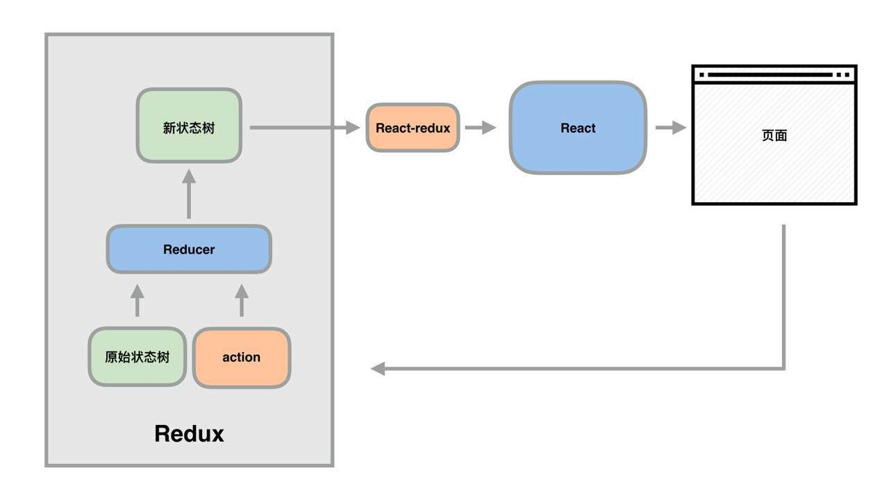

# 为什么学习redux

Redux 是一个配合 React 使用的数据流管理工具，负责组件间通信。只会 React 是不能做出复杂的 效果的。你可能也会说，组件间通信也可以直接用组件互相操作的形式，这个是有些情况是可以，但是如果没有 Redux ，组件间随意互相操作，很快代码就会变成面条代码的。


## Redux(三大概念：Store　action　reducer )

### 不使用Redux

通过子组件，修改父组件的 state ，然后把父组件的 state 作为所有子组件的 props 值传入各个子组件

这样就实现了各个兄弟组件间通信。

```js
在constructor里给事件绑定this，效率更高
this.handleSubmit=this.handleSubmit.bind(this)
```
```js
父
render() {
  return (
    <div>
      <div className='top clearfix'>
          <PostBody comment={this.state.all}/>
      </div>
      <div className='bottom clearfix'>
          <CommentBox num={this.handleNum}/>
      </div>
    </div>
  )
}
Search
handleSubmit(e){
    return this.props.num(this.state.comment.length+1)
}
Hello
 <div className='num comment-num'>评论{this.props.comment}</div>
```

### 使用Redux

```
npm i --save redux
```

redux是数据流管理工具。使用 Redux 的最重要的一句话：

**一切数据都要保存的 Store 之中，组件自己不保留自己的 state 数据**

一个总的关系就是：组件和 Store 的关系。

## store

把所有的数据都存放到 Store 中，然后所有的组件都订阅 Store 的数据。那么数据就有了 Single Source of Truth （唯一可信数据源）。这样的好处就是：

- 第一，各个组件都统一读写同一个数据，组件间通信变得不成问题了
- 第二，就是数据统一存放，代码比较不容易写乱

### 创建(create)一个store => createStore

就是将数据写到store.js中
```js
import {createStore} from 'redux'
let store = createStore(commentReducer)
export default store

```
发现 createStore 可以接收三个参数：

- reducer ，这一项是必须填写的
- preloadedState，预加载 State ，这一项是可选的
- enhancer，增强器，选填

那么又引出一个核心概念reducer

## reducer

reducer是一个函数，它的作用是接收action。action触发reducer执行

核心是：
```
(oldState,action)=> newState
```
写一个空的reducer
```js
function commentReducer(state = [], action) {
  return state;
}
```
## action

```js
let action = {
  type: 'ADD_COMMENT',
  comment: "hello3"
}
```
action 对象有两个部分组成：

- 第一部分，要有一个 type 属性，值是一个字符串。
- 第二部分，payload ，也就是这个 action 携带的数据

上面的这个形式，联想起了 axios 发 POST 请求（action 的接受方就是 reducer）。

发出一个 action 就是在组件内部,一般触发某个事件(点击按钮)时发出

```
store.dispatch(action)
```
每次dispatch，reducer 都去修改 state 值。

整个 store 中存储的 state 值，我们会把它叫做状态树 (state tree) 。状态树的具体值就是 store.getState() 的返回值。整个项目，只有一个状态树。

在某特定事件中dispatch 发出action  ——> reducer接收　——> reducer函数执行　——>  return 后，修改store　——> 其他组件通过store.getState()　拿到数据

之后问题又来了，发现更新了state值后,getState()拿不到更新的值，因为它只执行一次，这样并没有做到组件间的交流。我们希望组件自动重新render。

## 总体框图


## react-redux
redux可以配合多种框架使用，并不仅是针对react，store与react组件是没有联系的。需要react-redux绑定
```
npm i --save  react-redux
```
具体使用的两个接口：Provider connect

- Provider
```js
import {Provider} from 'react-redux'
```
Provider写在顶层　store属性的值为导出的状态树
```js
<Provider store={store}></Provider>
```
被 Provider 包括起来的组件中才能找得着 store

- connect
```js
export default connect(mapStateToProps)(PostBody)
```
connect 连接 store 和组件

mapStateToProps：把 store 中的数据（一部分）映射为当前组件的 props

map 的意思是“映射”
State 指的是 store 状态树（ State Tree ），也就是 store 的实际数据
Porps 就是属性

Store 中数据很多，当前组件需要的只是一部分，那么选取工作是在 mapStateToProps 中完成的
```js
const mapStateToProps = (state) => ({
  comments: state
});
```
上面的 (state) 指的就是 Store 中的全部状态，也即是 store.getState() 可以读到的内容。

使用时可以是this.props.×××

这样state改变就是造成props改变，会重新render

---
# 注意事项

## [注:１] store..js
```
状态树最好只写一个(对象)，比较方便
最终createStore只有一个reducer
return　后一定为一个对象，因为它会覆盖掉之前的全部state
```

## [注:2] 子组件
```
mapStateToProps时返回的也必须为一个对象，这样就可以用store里的任何值
```

## [注:3] 修改state

### 1. 一个原则:不可以直接修改state

[handle action](http://redux.js.org/docs/basics/Reducers.html)

在reducer只能修改state的拷贝，state本身不可以改变

所以方法有几种：

#### 对于对象Object
```
1.Object.assign({},state)
    let aa=Object.assign({},state)
    修改aa,不会使state发生改变

２．使用对象展开符...(Es7属性 babel测试)
    let bb={...state}
```

#### 对于数组array
```
1.arr.slice()

slice() 方法返回一个从开始到结束（不包括结束）选择的数组的一部分浅拷贝到一个新数组对象。

.slice(begin) 从当前索引到最后一个(包括最后一个)
.slice(begin,end)　从begin到end,不包括end


2.展开符...
```
### 2.操作
```
所有使state改变的操作都是在reducer里执行的，只有这样才可以引起子组件中props的改变，造成重新render,而action的作用仅是调用reducer
action可以只有一个type值
```

## [注:4] combineReducer

随着state的增加状态树也会变大，这样对于每次在一个reducer里修改的行为是十分麻烦的。

解决方案：拆分reducer

实现:
1.每个reducer负责一类数据，所以每个reducer不会很大
2.修改数据只需要在对应的reducer里修改某个属性

步骤:
1.拆分state
2.给每个state新建一个reducer
```
import {combineReducers} from 'redux'

function aReducer()
function bReducer()

const rootReducer　= combineReducers({
    a:aReducer,
    b:bReducer
    })
```
